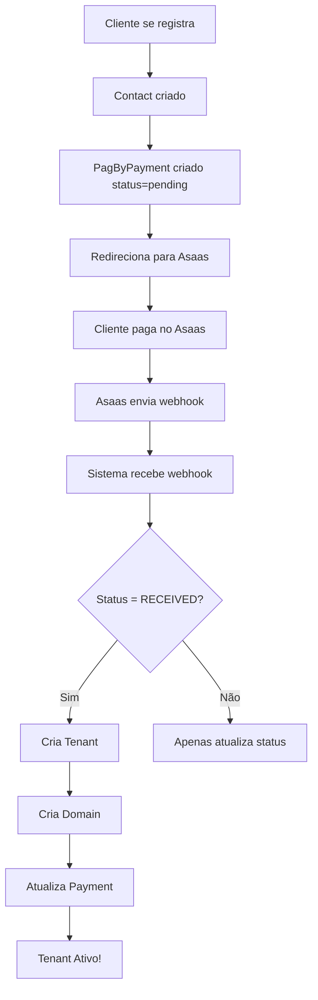

# 🎯 Exemplo Prático - Testando o Webhook

## Cenário Completo

Vamos simular todo o fluxo de um cliente que se registra e paga.

### 1️⃣ Dados Iniciais

Após registro, você terá:
- 1 registro na tabela `contacts`
- 1 registro na tabela `pag_by_payments` com `tenant_id = 'temp_XXX'`

### 2️⃣ Consultar Pagamento Criado

```sql
-- Buscar o último pagamento criado
SELECT 
    id,
    contact_id,
    tenant_id,
    status,
    amount,
    plan,
    asaas_payment_id,
    external_id
FROM pagby_payments 
ORDER BY created_at DESC 
LIMIT 1;
```

Exemplo de resultado:
```
id: 45
contact_id: 12
tenant_id: temp_12
status: pending
amount: 59.90
plan: premium
asaas_payment_id: NULL
external_id: chk_abc123xyz
```

### 3️⃣ Simular Webhook do Asaas

#### Método 1: Comando Artisan

```bash
php artisan asaas:test-webhook 45
```

Saída esperada:
```
🔍 Buscando pagamento ID: 45...
✅ Pagamento encontrado:
+-------------+-------------------+
| Campo       | Valor             |
+-------------+-------------------+
| ID          | 45                |
| Tenant ID   | temp_12           |
| Status      | pending           |
| Valor       | R$ 59,90          |
| Plano       | premium           |
| Contact ID  | 12                |
+-------------+-------------------+

🚀 Simulando webhook do Asaas...
📡 Enviando POST para: http://localhost/pagby-subscription/webhook
✅ Webhook processado com sucesso!

📊 Resultado:
+------------------+-------------------+
| Campo            | Valor             |
+------------------+-------------------+
| Novo Status      | RECEIVED          |
| Tenant ID        | beautiful-salon   |
| Tenant Criado?   | SIM ✅            |
+------------------+-------------------+

🎉 Tenant criado com sucesso!
🔗 Domínio: beautiful-salon.localhost
📧 Email: cliente@email.com
📅 Assinatura até: 26/01/2026

📝 Verifique os logs para mais detalhes:
tail -f storage/logs/laravel.log
```

#### Método 2: Navegador

Acesse: `http://localhost/pagby-subscription/simulate-webhook/45`

Resposta JSON:
```json
{
  "success": true,
  "message": "Webhook simulado com sucesso",
  "payment_id": 45,
  "new_status": "RECEIVED",
  "tenant_created": true,
  "tenant_id": "beautiful-salon",
  "payload": {
    "event": "PAYMENT_RECEIVED",
    "payment": {
      "id": "chk_abc123xyz",
      "status": "RECEIVED",
      "customer": 12,
      "value": 59.90,
      "netValue": 56.90,
      "billingType": "CREDIT_CARD",
      "confirmedDate": "2025-12-26T18:30:00.000000Z"
    }
  },
  "webhook_response": 200
}
```

### 4️⃣ Verificar Resultados

#### Verificar Pagamento Atualizado

```sql
SELECT 
    id,
    tenant_id,
    status,
    asaas_payment_id,
    updated_at
FROM pagby_payments 
WHERE id = 45;
```

Resultado esperado:
```
id: 45
tenant_id: beautiful-salon (mudou de temp_12)
status: RECEIVED (mudou de pending)
asaas_payment_id: chk_abc123xyz
updated_at: 2025-12-26 18:30:15
```

#### Verificar Tenant Criado

```sql
SELECT 
    id,
    name,
    email,
    subscription_status,
    subscription_plan,
    subscription_start,
    subscription_end,
    employee_count,
    is_blocked,
    created_at
FROM tenants 
WHERE id = 'beautiful-salon';
```

Resultado esperado:
```
id: beautiful-salon
name: Beautiful Salon
email: cliente@email.com
subscription_status: active
subscription_plan: premium
subscription_start: 2025-12-26 18:30:15
subscription_end: 2026-01-26 18:30:15
employee_count: 3
is_blocked: 0
created_at: 2025-12-26 18:30:15
```

#### Verificar Domínio Criado

```sql
SELECT * FROM domains WHERE tenant_id = 'beautiful-salon';
```

Resultado esperado:
```
id: 123
domain: beautiful-salon.localhost
tenant_id: beautiful-salon
created_at: 2025-12-26 18:30:15
```

### 5️⃣ Acessar o Tenant

Adicione ao `/etc/hosts`:
```
127.0.0.1 beautiful-salon.localhost
```

Acesse no navegador:
```
http://beautiful-salon.localhost
```

### 6️⃣ Logs do Processo

```bash
tail -n 100 storage/logs/laravel.log | grep -A5 -B5 "Webhook Asaas"
```

Logs esperados:
```
[2025-12-26 18:30:15] local.INFO: === Webhook RECEBIDO ===
[2025-12-26 18:30:15] local.INFO: Webhook Asaas: {"asaas_payment_id":"chk_abc123xyz","asaas_status":"RECEIVED","event":"PAYMENT_RECEIVED"}
[2025-12-26 18:30:15] local.INFO: Pagamento atualizado via webhook Asaas {"payment_id":45,"old_status":"pending","new_status":"RECEIVED"}
[2025-12-26 18:30:15] local.INFO: 💰 Pagamento APROVADO! Iniciando criação do tenant... {"payment_id":45,"contact_id":12}
[2025-12-26 18:30:15] local.INFO: 🏗️ Criando tenant para: {"tenant_name":"Beautiful Salon","owner_name":"João Silva","email":"cliente@email.com"}
[2025-12-26 18:30:15] local.INFO: ✅ Tenant criado com sucesso! {"tenant_id":"beautiful-salon","domain":"beautiful-salon.localhost","payment_id":45}
```

## 🔄 Testar Novamente

Se quiser testar o mesmo pagamento novamente:

```sql
-- Resetar o pagamento
UPDATE pagby_payments 
SET 
    status = 'pending',
    tenant_id = 'temp_12',
    asaas_payment_id = NULL,
    updated_at = NOW()
WHERE id = 45;

-- Deletar o tenant criado
DELETE FROM domains WHERE tenant_id = 'beautiful-salon';
DELETE FROM tenants WHERE id = 'beautiful-salon';
```

Depois rode novamente:
```bash
php artisan asaas:test-webhook 45
```

## 📊 Dashboard de Monitoramento

Crie uma query útil:

```sql
-- Ver todos os pagamentos e seus tenants
SELECT 
    p.id as payment_id,
    p.status,
    p.amount,
    p.tenant_id,
    c.tenant_name as salon_name,
    c.email,
    t.subscription_status,
    t.subscription_end,
    p.created_at as payment_date,
    t.created_at as tenant_created
FROM pagby_payments p
LEFT JOIN contacts c ON p.contact_id = c.id
LEFT JOIN tenants t ON p.tenant_id = t.id
ORDER BY p.created_at DESC
LIMIT 10;
```

## 🎓 Entendendo o Fluxo



## 🚨 Troubleshooting Rápido

| Problema | Solução |
|----------|---------|
| Tenant não foi criado | Verifique se status é `RECEIVED` ou `CONFIRMED` |
| Erro "Contact não encontrado" | Verifique se `contact_id` no payment existe na tabela contacts |
| Erro "Slug já existe" | Sistema incrementa automaticamente (salon, salon1, salon2...) |
| Webhook não encontra payment | Verifique se `external_id` ou `asaas_payment_id` está correto |
| Domain não criado | Verifique logs, pode ser erro de constraint |

## ✅ Checklist Final

- [ ] Migration rodada com sucesso
- [ ] Comando `asaas:test-webhook` funciona
- [ ] Status muda de `pending` para `RECEIVED`
- [ ] Tenant é criado automaticamente
- [ ] Domain é associado ao tenant
- [ ] tenant_id no payment muda de `temp_X` para slug real
- [ ] Logs mostram sucesso
- [ ] Pode acessar tenant via subdomínio

🎉 **Tudo funcionando? Agora configure o webhook real no painel Asaas!**
